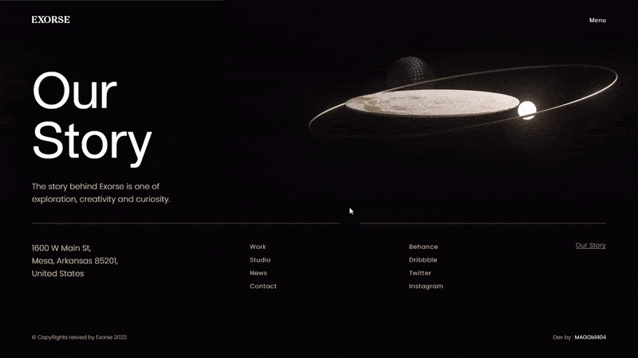

# SOTD-website

[](https://www.awwwards.com/sites/exo-ape)


This is the repository of [Exo-ape](https://www.exoape.com/) Dummy Code. We decided to be transparent and take a step forward in making this entire project open source so people can learn how to make the things we created. The website was awarded at [Awwwards](https://www.awwwards.com/sites/exo-ape) with Site of The Day and Developer Award in MAY 23, 2022.

# Site-view

### Site loading Animation
<!--  -->


### Site Page Transitions Animation
<!--  -->


### Site Portfolio Page's Slider Animation
<!--  -->


# Overview

### Front End

The front end of the portfolio was made entirely with plain JavaScript code using ECMAScript 2015+. It's also using libraries such as [GSAP](https://greensock.com/), [Locomotive Scroll](https://locomotivemtl.github.io/locomotive-scroll), [Lodash](https://lodash.com/) and [Three.js](https://threejs.org/). and using [Ajax](https://developer.mozilla.org/en-US/docs/Web/Guide/AJAX) for create page transitions. To generate our static files that will be uploaded to the environment, we're using [Webpack](https://webpack.js.org/).

### Note:

In the frontend (this repo), used images are no optimized. so, this dummy link performce is a lit-bit low. if, you want to boost your performce and reduce loading time, so compress all used images and used .webp & .jpg format.  

### Back End

The back end of the portfolio was made with [Express](https://expressjs.com/) and [Prismic](https://prismic.io/). There's nothing fancy happening in the logic of it, it's just a bunch of routes and some data that will populate our [Pug](https://pugjs.org/api/getting-started.html) views.

# Getting Started

You need to have [Node.js](https://nodejs.org/en/) and [npm](https://www.npmjs.com/) installed in your machine, these are our only dependencies to run the project locally.

After that, you need to setup an account at [Prismic](https://prismic.io/) and create your fields with the same names used by this application, in the end of this README file you're able to find all the instructions related with it.

We're using a `.env` file to retrieve our credentials used by Prismic and also the Google Analytics ID. So you need to create a `.env` file in the root of this application like this:

```
GOOGLE_ANALYTICS=YOUR_GOOGLE_ANALYTICS

PRISMIC_ACCESS_TOKEN=YOUR_ACCESS_TOKEN
PRISMIC_CLIENT_ID=YOUR_CLIENT_ID
PRISMIC_CLIENT_SECRET=YOUR_CLIENT_SECRET
PRISMIC_ENDPOINT=YOUR_ENDPOINT
```

After creating your `.env` file and setting up your Prismic account, you're able to run your project without any problems by running the commands below in your terminal.

```sh
# Clone the project.
git clone https://github.com/MAGGIx1404/awwward-rebuild-SOTD--2.git

# Install npm depedencies.
npm install

# Configure .env variables and run the website.
npm run dev
```

# Prismic

I think this might be the trickiest part of running this project locally, you need to understand how Prismic works, then create your fields there and then finally populate the content. To make your life easier, I'm providing all JSON structures inside the `prismic` folder of this repository. Don't forget to match the names used in the JSON files with the ID of your Custom Type of Prismic.
